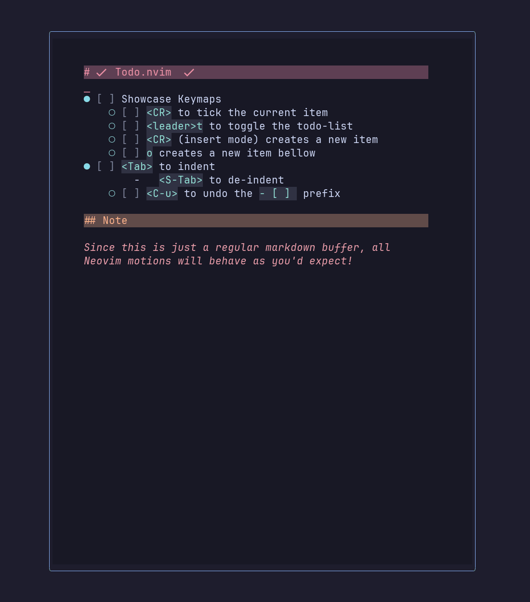

# ✔️  Todo.nvim

**Todo.nvim** helps you keep focused on what matters by quickly toggling and typing TODOs inside a togglable scratch buffer.

## ✨ Features

- **Tick**: Press `<CR>` when in Normal mode to tick/untick the current line's todo
- **Easy Checkboxes**: `<CR>` and `o` will all prepend the `- [ ]` prefix automatically
- **Open**: Press `<leader>t` to open the todo-list
- **Exit**: Press `q`, `<leader>t`, `<C-o>` or `<C-c>` to close the window
- **Indent**: Press `<Tab>`(n) and `<S-Tab>`(n) to easily indent the todos
- **Layout**: Nice looking floating window with padding
- **Resize**: Window automatically resize along with Neovim

## 🎥 Demo



## ⚡️ Requirements

- Neovim >= 0.10.0
- for better markdown rendering _(optional)_:
  - [render-markdown](https://github.com/MeanderingProgrammer/render-markdown.nvim)

## 📦 Installation

Install the plugin using your favorite package manager:

[lazy.nvim](https://github.com/folke/lazy.nvim):

```lua
{
  "Enethen/todo.nvim",
  keys = {
    {
      "<leader>t",
      function()
        require("todo").toggle()
      end,
      desc = "Toggles Todo-List",
    },
  },
  dependencies = {
    -- "MeanderingProgrammer/render-markdown.nvim" -- For better markdown rendering
  },
  opts =
  ---@type TodoNvim.Config 
  {
    -- your configuration comes here
    -- or leave it empty to use the default settings
    -- refer to the configuration section below
  },
}
```

## ⚙️ Configuration

```lua
---@class TodoNvim.Config
---@field disable_diagnostics boolean
---@field document_name string | fun(): string
---@field save_path string
---@field buffer_listed boolean
---@field development_logs boolean
---@field width number
---@field height number
---@field vertical_padding number
---@field horizontal_padding number
---@field border string
---@field style string
---@field default_text fun(): string[]
local defaults = {
  disable_diagnostics = true, -- disables diagnostics of markdown LSP/Linters
  document_name = M._default_name, -- can be either a string or a function
  save_path = "todo-lists/", -- Path to the saving folder, relative to the CWD
  buffer_listed = true, -- should the Todo-list buffer be listed? see :h buflisted
  width = 0.35, -- Width of the Window (percentage of the screen)
  height = 0.8, -- Height of the Window (percentage of the screen)
  vertical_padding = 3, -- Amount of padded lines (Vertical)
  horizontal_padding = 6, -- Amount of padded characters (Horizontal)
  border = "rounded", -- Border style, see h: nvim_open_win
  style = "minimal", -- Style of the window, see h: nvim_open_win
  default_text = function() -- The default text upon opening the window for the first time
    local lines = {
      "# TODO List",
      "",
      "- [ ] Item1",
    }
    return lines
  end,
}
```

## TODOs Features

- [ ] Saving todo lists
  - [ ] Configurable `global`, `project` and `scratch-only` options for saving behaviours.
  - [ ] Configurable save path, [save_path = "example"] leader to `example/`, `./example` respectively.
  - [ ] Easy todo-lists retrieving via fuzzy pickers (telescope, fzf or Snacks)
  - [ ] Create autocommands: `TodoNew`, `TodoOpen` (defaultin to most recent)
  - [ ] Dev todolist fecthin based on `save_path`.

## Acknoledgement

This is my first Neovim plugin, which I made thanks to [Teej](https://www.youtube.com/@teej_dv)'s [tutorials](https://www.youtube.com/watch?v=VGid4aN25iI&list=PLep05UYkc6wTyBe7kPjQFWVXTlhKeQejM&index=19) and following [Folke](https://github.com/folke)'s awesome READMEs formatting and plugin's structure 😊

The idea came from this [video](https://www.youtube.com/watch?v=LaIa1tQFOSY) from Coding With Sphere.
Since I did not find such a plugin, I decided to give it a shot!
